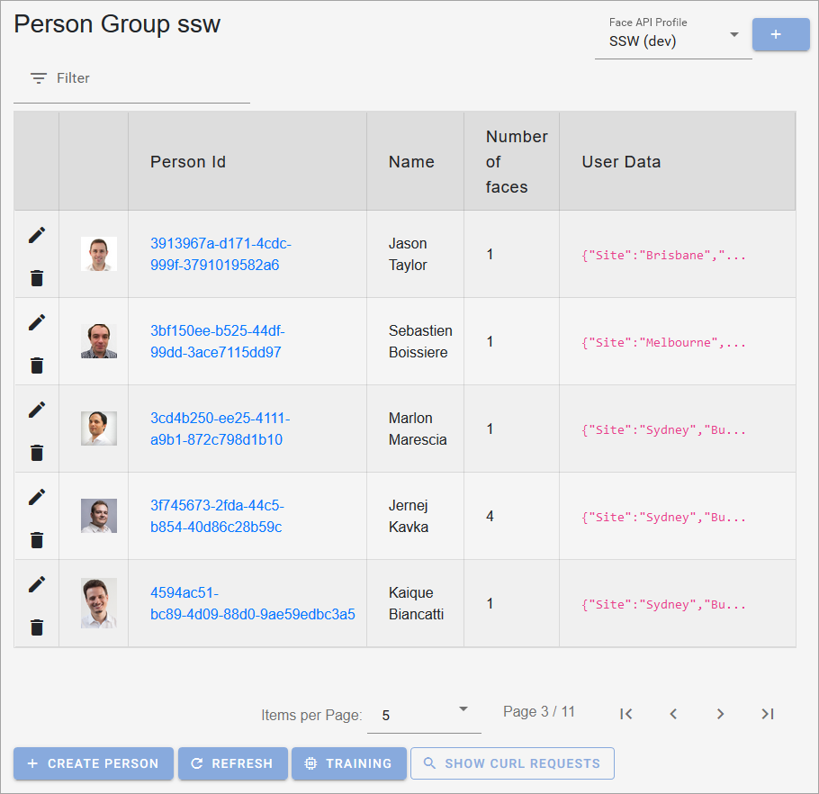
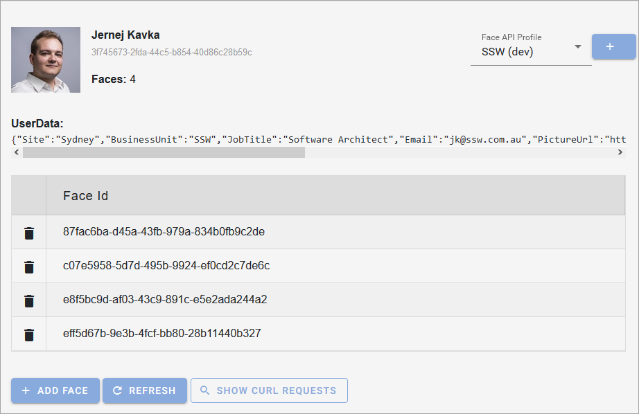

This is a PWA enabled app used to showcase what Cognitive Services can do, built-in client-side Blazor.

You can use it on your machine, table or phone. iOS currently not supported as it uses WASM via client-side Blazor.

Pull requests are welcomed! 😄

## Demo

You can check out [live demo](https://jernejk.github.io/CognitiveServices.Explorer/)

**Explorer all of the groups on your account.**

**See all of the identities and you can configure it to see their picture.**

**See user details.**

**Detect and identify people by URL, file upload or web cam.**

**You can switch and create new profiles link to your Azure Face API.**

**NOTE:** Currently not working on iOS. (https://github.com/mono/mono/issues/16986)

**NOTE 2:** Microsoft is not storing images in Azure Face API. You need to add property `ImageUrl` as JSON in `userData`.

## Supported features

### Face API

#### Feature implemented

* Multiple Face API accounts
* Explore and manage groups, identities and faces
* Show cURL requests
* Train group
* Check if the group has been trained
* Detect/Identify
  * From web cam
  * From file upload
  * From URL
  * Identify from the detected faces
  * Different detection/recognition models

<!--
#### Features planned in the coming weeks

* Update face (user data only)
* Detect faces
  * Emotions, gender, age, etc.
  * ~~From web cam~~
  * ~~From file upload~~
  * ~~From URL~~
* Find similar faces
* Verify face
-->

### Other Cognitive Services in planning (coming months)

* Text Analyzer
* Translation
* Language Understanding
* Search
* Anomaly Detector 
* Computer Vision
* Ink Recognizer
* Form Recognizer
* Spell Checker
